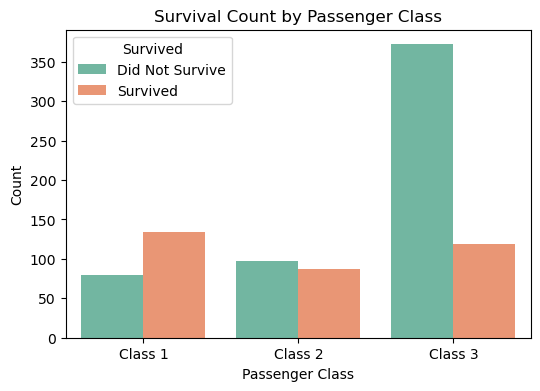
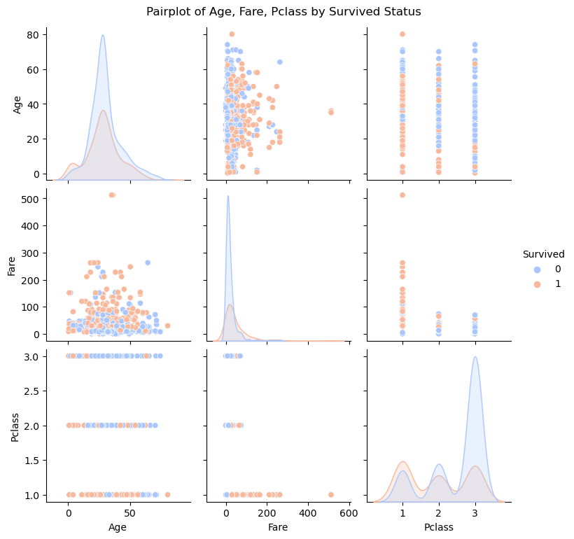
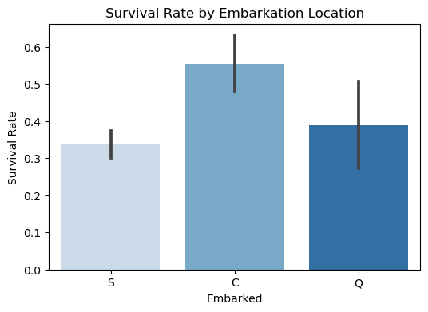

# Titanic Data Analysis and Visualization
This project provides a comprehensive analysis and visualization of the Titanic dataset. The goal is to explore different passenger characteristics, survival rates, and factors influencing the survival of passengers aboard the Titanic.

## Table of Contents
1. Introduction
2. Dataset Overview
3. Data Analysis
3.1. Survival Analysis
3.2 Passenger Class Analysis
3.3 Embarkation Location Analysis
4. Visualizations
4.1 Survival vs. Passenger Class
4.2 Age, Fare, and Survival Correlation
5. Conclusion

## Introduction
The Titanic dataset contains information about passengers aboard the Titanic, including personal details such as their age, sex, passenger class, and whether they survived the disaster. This dataset is widely used for machine learning exercises and data analysis projects to build models predicting passenger survival rates.

## Dataset Overview
The dataset contains the following columns:

- Survived: Whether the passenger survived (1) or not (0)
- Age: The age of the passenger
- Fare: The fare the passenger paid for the ticket
- Pclass: The class of the passenger's ticket (1st, 2nd, or 3rd class)
- Embarked: The port of embarkation (C = Cherbourg; Q = Queenstown; S = Southampton)
- Sex: Gender of the passenger
- SibSp: Number of siblings/spouses aboard
- Parch: Number of parents/children aboard

## Data Analysis
### Survival Analysis
The primary goal is to analyze the survival rate among different passengers. Key factors include:

### Passenger Class
Sex
Age

### Embarkation Location
Passenger Class Analysis
An analysis is performed to compare the survival rate across different classes (1st, 2nd, 3rd) to understand how class impacted the chances of survival.

Embarkation Location Analysis
Survival rates are further analyzed based on the embarkation location (Embarked column) to identify whether passengers embarking from certain locations had better survival rates.

## Visualizations
### Survival vs. Passenger Class
A bar plot is used to show the survival rate for passengers in each class. This helps us understand whether the class of travel had a significant impact on survival.

### Age, Fare, and Survival Correlation
Pairplots and scatter plots are created to analyze the relationship between age, fare, and survival status. This visualization aims to identify patterns or correlations between these factors.

### Embarkation Location and Survival Rate
A bar plot visualizes the survival rate for passengers based on the embarkation port. This shows if passengers boarding from certain locations had a higher chance of survival.

## Conclusion
This project provides useful insights into the Titanic disaster, including which factors influenced survival rates. By visualizing survival data based on various factors like passenger class, age, and embarkation port, we can better understand the characteristics that played a role in the survival of passengers.